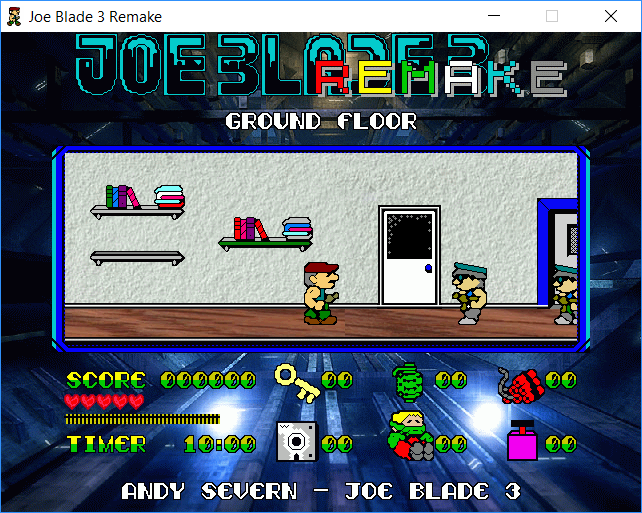

# JOE BLADE 3 REMAKE
(c) 2004 by Maxim Mozgovoy and Anton Mozgovoy

March 2010 revision: bugfixes, smooth scrolling, separate configuration tool.
January 2019 revision: bugfixes, double screen resolution, upgrade to C++Builder 10.

-------------------------------------------------

## HISTORY AND GAME DESCRIPTION

Joe Blade 3 Remake is based on the original game Joe Blade 3, (c) 1989 by Players Software. Joe Blade 3 was available on Amstrad CPC and ZX Spectrum home computers.

Joe Blade 3 offers an amazing action in a building, consisting of 31 floors + a roof (which gives you 542 locations in total). Your mission includes several objectives:

- Save 6 hostages.
- Capture enemy leader Crax Bloodfinger.
- Rig 6 explosives to blow up the building.
- Escape via the roof.

You can complete objectives in any order, but beware: you have only 10 minutes to finish your task after any explosive is rigged!

There are also three (similar, but still different) types of subgames. You have to figure out yourself their rules in order to complete the game :)

The original instructions are available on [World of Spectrum](http://www.worldofspectrum.org/pub/sinclair/games-info/j/JoeBladeIII.txt).

## REMAKE FEATURES

- Significantly improved graphics.
- Faithful gameplay.
- In-game save/load feature.
- Smooth scrolling (in addition to faithful room-based action).
- A jukebox with 14 great soundtracks, including music from the original Joe Blade game series.

## SYSTEM REQUIREMENTS AND COMMAND-LINE SWITCHES

The normal speed for the game is 25 frames per second. With default settings, any 400 MHz or faster computer with 15-20 Mb of free RAM should be enough. The game supports several useful command-line switches:

<tt>/f&nbsp;&nbsp;</tt>: fullscreen mode;
<tt>/fps</tt>: show FPS;
<tt>/se&nbsp;</tt>: enable smooth scrolling;
<tt>/ns&nbsp;</tt>: no sound;
<tt>/dj&nbsp;</tt>: disable jukebox;
<tt>/ds&nbsp;</tt>: set double screen size.

There are also some switches you can use for cheating :) (true cheaters will find a way to cheat in any case):

<tt>/ie</tt>: infinite energy;
<tt>/ia</tt>: infinite ammo;
<tt>/t&nbsp;</tt>: stop all timers;
<tt>/l&nbsp;</tt>: get all liftcards;
<tt>/kd</tt>: get 50 keys and disks.

Instead of using command-line switches, you can set options with the tool `Configure.exe`.

## CONTROLS

Movement: cursor keys.
Fire: space bar.
Jukebox on/off: Ctrl key.
Play another track: Shift key.

## REMAKE AUTHORS

Joe Blade 3 Remake is created by two brothers &mdash; Maxim Mozgovoy and Anton Mozgovoy.

Maxim (responsible for most project features) in 2004 was doing his computer science PhD studies in St.-Petersburg, Russia and Joensuu, Finland. As of 2019, he is an associate professor at the University of Aizu, Japan.

Anton (who mostly worked on graphics) in 2004 was studying at Pyatigorsk State Linguistic University, Russia. As of 2019, he is as a freelance journalist and a PC power user, living in Vladikavkaz, Russia.

Feel free to contact us in any case.

Maxim: mozgovoy@u-aizu.ac.jp
Anton: mozgovoy_anton@rambler.ru

-------------------------------------------------

## Hacking

If you want to modify the game, here is all the information you need.

### Files and Folders

Project files are organized as follows.

- `ExtraAssets`. Graphics and music that was not included into the game after all.
- `JoeBlade`. Main project folder.
- `Lib`. Libraries and sources of additional tools:
    * `Bass`: [BASS audio library](http://www.un4seen.com/), precompiled for C++ Builder;
    * `LevelEditor`: custom level editor for the game;
    * `LevOpt`: a tool for converting level files into individual rooms (required by the development pipeline); 
    * `MakeResFile`: a tool for packing assets into resource files (required by the development pipeline);
    * `MyGIFLoader`: animated GIF files support for SDL library;
    * `ResourceFile`: a library for extracting individual resources from resource files;
    * `SDL_bcb`: [Simple DirectMedia Layer](https://www.libsdl.org/) (SDL) library v1.2.6, precompiled for C++ Builder;
    *  `SDL_Image`: [SDL_Image](https://www.libsdl.org/projects/SDL_image/) library, precompiled for C++ Builder;
    * `bass24.zip`: complete BASS 2.4 distribution;
    * `SDL_gfx-2.0.25.tar.gz`: complete [SDL_gfx](http://www.ferzkopp.net/wordpress/2016/01/02/sdl_gfx-sdl2_gfx/) distribution (the game uses its `SDL_rotozoom` module);
    * `SDL_image-1.2.12.zip`: complete SDL_Image distribution;  
    * `SDL-1.2.15.zip`: complete SDL distribution.
- `Resources`. Multimedia assets used in the game.
- `BuildAll.bat`. Main build script. Builds `JoeBlade3.groupproj`.
- `PrepareTools.bat`. Copies compiled tools into `Resources` folder for subsequent use.
- `PrepareRelease.bat`. Prepares the resulting game archive `JoeBlade3_remake.zip`.

To build the project, [Embarcadero C++ Builder](https://www.embarcadero.com/ru/products/cbuilder/starter) is required.

### Designing Game Levels

Run `LevelEditor.exe` from the `Resources` folder. Open and edit `*.lev` files inside `Levels` subfolder as necessary. Note the following points:

- Layer 3 is reserved for interactive objects such as explosives, keys, cards, grenades, etc.
- Layer 5 is reserved for elements that mark up passages, doors, computers, etc.
- Level files should be named as `<floorNo>.lev`.
- Each level file should be accompanied with a file `<floorNo>.lev.start` contanining zero-based coordinates of the lift room.
- Objects are randomly shuffled before each game session. Lift cards are placed in a way to guarantee accessibility (Joe won't be locked inside bottom floors with no lift cards available). 